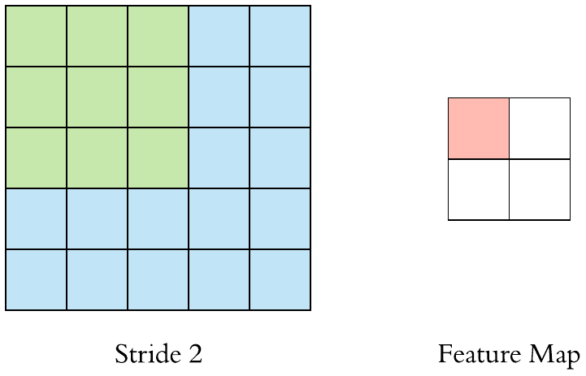
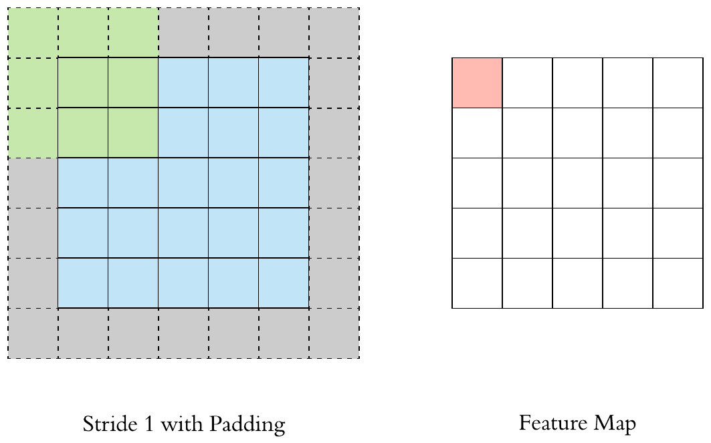
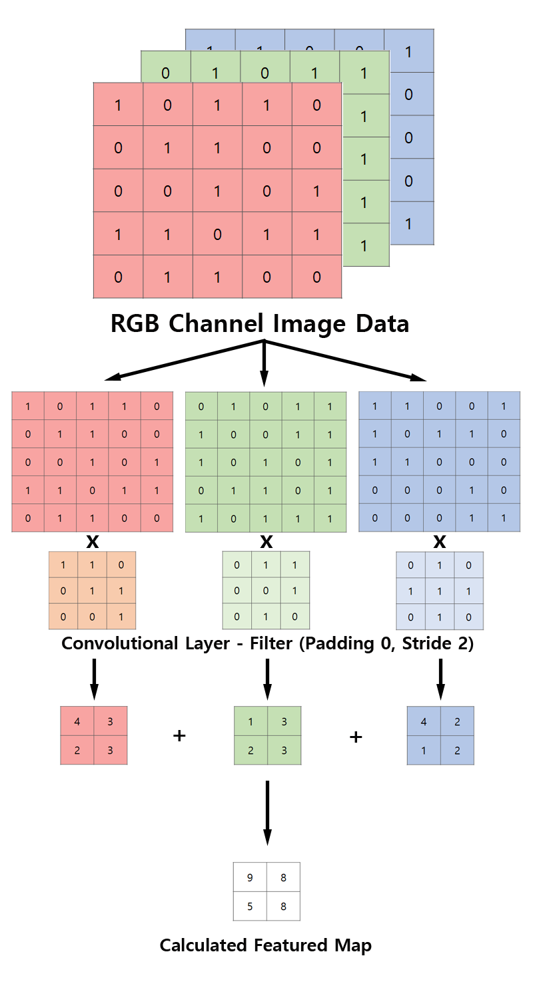

# Convolutional Neural Network

## What is Convolutional Neural Network

- Feed-Forward 방식
- DNN을 개선하기 위해 만들어짐
- 어디에 쓸까 ?
  - Data Extraction
  - Object Classification
  - Object Detection(Recognition)

## Difference with DNN

### DNN(Deep Neural Network)

- DNN은 `Fully-connected layer(Dense Layer, Flatten Layer)`로만 구성되어있다.
- Fully-connected Layer는 모든 데이터를 선형 뉴런으로 나열하여 1차원적인 데이터만 처리할 수 있음
- 그런데 우리가 주로 사용하는 이미지는 3차원(R, G, B)
- 이러한 모델에 우리가 사용하는 3차원인 이미지를 넣으면 1차원으로 변환하여 계산을 해야함
- 3차원에서 1차원으로 변환하는 동안 데이터 손실이 있음
- 그러면 당연히 Output의 퀄리티도 떨어짐

### Fully-connected Layer

- Fully-connected Layer는 모든 레이어가 이전 계층 레이어들의 뉴런과 모두 연결(Fully-connected)되어 있어있다.
- 그러므로 레이어가 많아질 수록 파라미터의 수가 같이 증가함
- 파라미터의 수가 늘어 난다는 것은 매 레이어마다 기억해야 할 데이터가 늘어난다는 것
- 그래서 모델의 크기가 크고, 속도도 느림

### CNN에서 바뀐 것

- Fully-connected Layer를 쓰지 않음
- 대신 Convolutional Layer와 Pooling Layer를 쓴다
- 그렇다고 Fully-connected Layer를 아예 안 쓰는 것은 아님
  - 마지막 Output 레이어는 DNN과 같이 `Fully-connected Layer - Softmax`구조
- DNN과 크게 다른 점은 이미지에서 Feature(특징점)을 찾아내어 그것을 인식하는 방식
  - 예를들어 고양이와 개의 생김새는 특징적으로 대놓고 다르다
  - 고양이의 특징과 개의 특징을 찾아내고 분류하고 학습시키면 Cat/Dog Classification Model이 됨!

## Structure

`Input - [ Convolutional Layer - Pooling Layer(Optional) - ReLU ] - [ ... ] - Fully Connected Layer - Softmax(Optional Maybe)`

입력을 받고 `Convolutional Layer - Pooling Layer(Optional) - ReLU`구조를 적당한만큼 반복한 다음 `Fully-connected Layer`를 거쳐 1차원적인 선형 데이터로 변환된 뒤 `Softmax` 함수를 거쳐 Output을 산출함.

### Convolutional Layer

- **Convolution**은 **합성 곱**이라는 뜻
- Convolutional Layer = 합성 곱을 하는 레이어

합성 곱이라는 말만 들으면 정확히 무슨 뜻인지 이해가 잘 안간다. 아래 이미지를 보자

위의 이미지에서 파란색, 초록색, 빨간색으로 표시된 부분을 각각 `Input Image`, `Convolution Filter(혹은 Kernel)`, `Featured Map`이라 한다.

위 이미지는 5x5 크기의 Input Image에 Filter를 한 칸씩 움직여 곱한 후 곱한 결과를 모두 더한 뒤 Featured Map을 구성하는 것을 볼 수 있다.
또한 Filter에 표시되는 값은 (**해당 좌표의 값 * 필터의 가중치**)이다. 이 예제에서는 X자 모양의 Feature를 검출하는 것으로 생각할 수 있다.

#### Stride

이 예제에서 Filter는 한 칸씩 움직이는데 이 Filter 움직이는 정도를 `Stride`라 하며 위의 경우 `Stride = 1`이라 할 수 있다.
Stride가 크게 움직인다면 그 만큼 계산량도 줄어드므로 Featured Map의 크기도 작아진다.

아래는 위와 같은 Input Image와 Filter가 주어질 때 `Stride = 2`인 경우를 시각화한 이미지다.

#### Padding

지금 우리가 봐온 예제는 5x5 Input Image를 Filter를 거쳐 5x5보다 작은 Shrink된 Featured Map을 구성하는데,
만약 Input Image과 같은 크기의 Featured Map을 구성하고 싶다면 어떻게 해야할까?

Filter를 1x1 크기로 구성하는건 Feature를 검출하지 못하므로 의미가 없다.
그래서 우리는 가장자리에 0 또는 임의의 값을 채워넣어 Input Image 크기를 늘리는 방식을 사용한다.
여기서 가장자리를 얼마나 두껍게 더 구성할지 정하는 값을 `Padding`이라 한다. 아래 이미지를 보자.

### Pooling Layer

`Pooling`이란 Matrix의 가로/세로 크기를 축소시키는 연산을 말하며, Pooling Layer는 Pooling을 하는 Layer를 말한다.
Pooling은 Filter와 같이 일정 크기의 Window(Matrix라 생각하자)를 덮고 그 중 Pooling 방식에 따라 최댓값 또는 평균값을 구하는데
일반적으로 Pooling Window의 크기와 Stride를 같은 값으로 설정하여 모든 원소가 계산에 한번씩만 참여하도록 설정한다.

Pooling 연산에는 `Max Pooling`과 `Avarage Pooling`이 있는데, 주로 Max Pooling을 사용한다.

Max Pooling은 말 그대로 최대값을 사용하여 축소시키는 것이고, Avarage Pooling은 평균 값을 사용하는 것인데 아래 이미지는 4x4 Image에 2x2 Max Pooling을 적용한 것이다.

### 3D Convolution

위에서 본 이미지들은 이해를 돕기 위하여 1차원 데이터를 Convolution하는 예제 이미지를 사용했는데 실제 우리가 쓸 RGB채널을 가진 3D 데이터는 어떻게 처리하는지 보자.

위 이미지 역시 이해를 돕기 위한 이미지임을 기억하자. 필터는 R,G,B 채널마다 각 하나씩 있을수도, 1개 혹은 2개일수 있다. 

### Hyperparameters

CNN 모델에서 Hyperparameter는 아래와 같다.

- **Filter Size**
   일반적으로 3x3을 많이 사용한다. 왜냐하면 5x5 Filter는 3x3 Filter가 완벽히 대체 가능하기 때문인데
   한번에 25번의 연산을 하는 것보다 9번의 연산을 여러번 하는 것이 더 효율적이기 때문이다.  
- **Filter Count**
  Filter를 많이 거칠 수록 좋은 결과가 나온다. 하지만 너무 많은 Filter를 거친다면 Overfitting의 위험이 있으니 주의해야한다.
  주로 2^n 꼴의 값(그 중에서도 32 <= x <= 1024)으로 Filter의 수를 정한다.
- **Stride, Padding**
  Stride와 Padding 역시 중요하다. Filter가 적절한 Featured Map을 구성 할 수 있도록 적절한 값의 Stride와 Padding을 찾는 것이 중요하다.
  Hyperparameter들의 적정한 값은 아래 공식을 통해서 찾을 수 있다.

<!-- `Output Size = 1 + (Input Size - Filter Size) / Stride` -->
}{Stride})

단 위 공식을 사용하려면 Output Size가 정수여야 한다.
예를 들어 `Input Size = 7, Filter Size= 3, Stride = 3`이라면 결과는 `2.3333...` 이므로 Filter Size나 Stride를 조정해주어야 한다.
