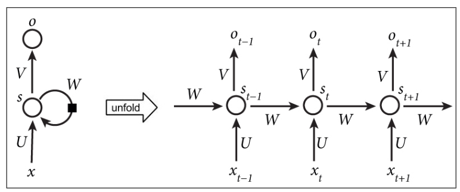

# Recurrent Neural Network와 언어 모델

임의의 시퀀스 입력을 처리한 수 있는 RNN의 능력은 언어 모델링이나 발화 인식 등의 일을 할 수 있게 한다. 사실, 이론상 RNN은 튜링 완전하므로 어떤 문제에도 적용할 수 있다. 이것은, 어떤 컴퓨터가 할 수 있는 모든 일들을 할 수 있다는 의미이다.

이 장에서는 다음의 내용을 다룬다.

- 간단한 문제에 대해서 어떻게 간단한 RNN을 만들고 학습시키는가
- RNN에서의 gradient vanishing 과 gradient exploding 문제와 이를 해결하는 법
- long-term memory learning을 위한 LSTM모델
- 언어 모델과 어떻게 RNN이 이 문제에 적용될수 있는가
- 발화 인식에 딥 러닝의 적용하는 짧은 소개

## RNN

RNN은 시퀀스에 대해서 같은 함수를 재귀적으로 적용하는 것에서 그 이름이 유래되었다. RNN의 재발 관계는 다음의 함수로 표현될 수 있다.
> $$S_t = f(S_{t-1},X_t)$$

왼쪽은 RNN의 반복관계를 나타낸 것이다: $S_t = S_{t-1}*W+X_t*U$, 최종 결과는 $o_t = V*S_t$가 될 것이다.

$f$는 아무 미분 함수가 될 수 있다. 예를 들어, 기본적인 RNN은 다음의 반복 관계를 가진다. 

>$S_t = tanh(S_{t-1}*W+X_t*U)$

여기서 $W$는 상태에서 상태로 가는 선형 변환을 정의하며, $U$는 입력에서 상태로 가는 선형 변환을 정의한다. tanh 함수는 ReLU나, logit 등의 다른 변환 함수로 대체되어질 수 있다.

예를 들어, 단어 레벨의 언어 모델에서는, 입력 X는 입력 벡터로 변환된 단어의 시퀀스가 될 것이다. 상태 S 는 상태 벡터의 시퀀스가 될 것이다. 그리고 출력 O는 시퀀스의 다음 단어로의 확률 벡터일 것이다.

RNN에서, 각 상태는 재발 관계에 따라 이전의 계산으로부터 독립적이다. 여기서 중요한 함축은 RNN은 상태 S 가 이전 단계의 정보를 저장하고 있기 떄문에 일정 기간을 기억할 수 있는 메모리가 있다. 이론상, RNN은 오로지 몇 단계 전만 기억할 수 있다. 이는 뒤에서 Vanishing and exploding gradients 단원에서 자세히 다룰 것이다. 