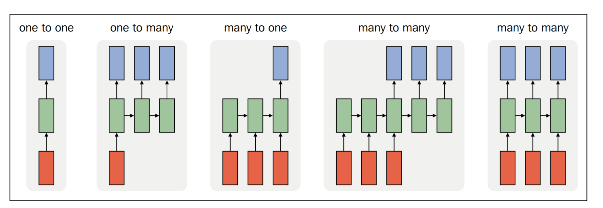
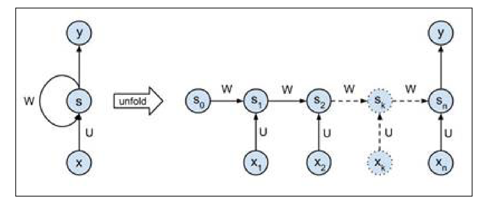

# Recurrent Neural Network와 언어 모델

임의의 시퀀스 입력을 처리한 수 있는 RNN의 능력은 언어 모델링이나 발화 인식 등의 일을 할 수 있게 한다. 사실, 이론상 RNN은 튜링 완전하므로 어떤 문제에도 적용할 수 있다. 이것은, 어떤 컴퓨터가 할 수 있는 모든 일들을 할 수 있다는 의미이다.

이 장에서는 다음의 내용을 다룬다.

- 간단한 문제에 대해서 어떻게 간단한 RNN을 만들고 학습시키는가
- RNN에서의 gradient vanishing 과 gradient exploding 문제와 이를 해결하는 법
- long-term memory learning을 위한 LSTM모델
- 언어 모델과 어떻게 RNN이 이 문제에 적용될수 있는가
- 발화 인식에 딥 러닝의 적용하는 짧은 소개

## RNN

RNN은 시퀀스에 대해서 같은 함수를 재귀적으로 적용하는 것에서 그 이름이 유래되었다. RNN의 재발 관계는 다음의 함수로 표현될 수 있다.
> $$S_t = f(S_{t-1},X_t)$$


왼쪽은 RNN의 반복관계를 나타낸 것이다: $S_t = S_{t-1}*W+X_t*U$, 최종 결과는 $o_t = V*S_t$가 될 것이다.

$f$는 아무 미분 함수가 될 수 있다. 예를 들어, 기본적인 RNN은 다음의 반복 관계를 가진다.

>$S_t = tanh(S_{t-1}*W+X_t*U)$

(뭔가 했는데, 이전 State에 네트워크 가중치 W가 곱해진 값을 Bias로 갖는 거심)

여기서 $W$는 상태에서 상태로 가는 선형 변환을 정의하며, $U$는 입력에서 상태로 가는 선형 변환을 정의한다. tanh 함수는 ReLU나, logit 등의 다른 변환 함수로 대체되어질 수 있다.

예를 들어, 단어 레벨의 언어 모델에서는, 입력 X는 입력 벡터로 변환된 단어의 시퀀스가 될 것이다. 상태 S 는 상태 벡터의 시퀀스가 될 것이다. 그리고 출력 O는 시퀀스의 다음 단어로의 확률 벡터일 것이다.

RNN에서, 각 상태는 재발 관계에 따라 이전의 계산으로부터 독립적이다. 여기서 중요한 함축은 RNN은 상태 S 가 이전 단계의 정보를 저장하고 있기 떄문에 일정 기간을 기억할 수 있는 메모리가 있다. 이론상, RNN은 오로지 몇 단계 전만 기억할 수 있다. 이는 뒤에서 Vanishing and exploding gradients 단원에서 자세히 다룰 것이다.

RNN은 입력이 고정되 크기로 제한되어있지 않기 때문에, 이들은 우리가 다른 크기의 이미지나, 다른 길이의 문자열들처럼 뉴럴 네트워크로 풀고 싶은 모든 문제들로 확장할 수 있는 가능성이 있다. 다음의 그림들은 우리가 만들 수 있는 시퀀스의 조합이다. 각 조합에 대한 설명은 다음과 같다.



- `1 대 1` : 이는 전방향제어나, CNN과 같은 비연속적 처리이다.
- `1 대 다` : 이는 하나의 입력에서 시퀀스를 반환한다. 이는 주로 caption과 같은 작업에 사용된다.
- `다 대 1` : 이는 시퀀스 입력에 대해서 하나의 결과를 반환한다. 이는 ㅜㅈ로 문장으로부터 분류를 수행할 때 사용된다.
- `간접적 다 대 다` : 입력 시퀀스가 상태 벡터로 변환된 후, 다시 새로운 시퀀스로 변환되는 언어 변역과 같은 과정에 사용된다.
- `직접적 다 대 다` : 이는 매 입력 단계마다 결과를 반환하며, 음성 인식에서 프레임 단위 라벨링에 사용된다.

## RNN - 어떻게 만들고 학습시키나

이전 구역에서 우리는 RNN이 무엇이고, 어떤 문제들을 해결할 수 있는지 알아보았다. 이 단원에서는 RNN의 세부와 어떻게 학습시키는 지에 대한 내용을 시퀀스 내에 1의 개수를 세는 간단한 예제를 통해 다룰 것이다.

이 문제에서, 우리는 기본적인 RNN에게 입력에서 1의 개수를 세고 시퀀스의 끝에서 결과를 반환하는 것을 가르칠 것이다. 다음은 입력과 출력의 예제이다.

> In : (0,0,0,0,1,0,1,0,1,0)
> Out : 3

우리가 학습시킬 이 네트워크는 매우 간단하며 다음과 같이 도식화된다.



이 네트워크는 2개의 인자만 가질 것이다.

- 입력 가중치 $U$
- 재현 가중치 $W$

출력 가중치 $V$ 는 1로 설정하여 우리는 맨 마지막의 상태$y$만을 읽어오도록 한다. 이 네트워크에 정의된 재발 관계는 $S_t=S_{t-1}*W+X_t*U$ 이다. 우리가 공식에 비선형적인 함수를 적용하지 않았으므로, 이것은 선형적인 모델이다. 이 함수는 다음의 코드로 나타내어질 수 있다.

```python
def step(s,x, U,W):
    return x*U+s*W
```

## 시간에 따른 역전파

시간에 따른 역전파 알고리즘은 재발 네트워크를 학습할 때 사용하는 전형적인 알고리즘이다. 이 이름은 2장에서 다룬 역전파 알고리즘을 이미 내포하고 있다.

만약, 여러분이 일반적인 역전파 알고리즘을 이해했다면, 시간에 따른 역전파 알고리즘은 어렵지 않을 것이다. 주된 차이점은 재현 네트워크는 time step에 만큼 언폴딩(루프의 하드코딩화)되어야 한다는 것이다. 언폴딩이 끝난 뒤에, 우리는 이 네트워크가 일반적인 다층 피드 포워드 네트워크와 크게 다르지 않다는 것을 볼 수 있을 것이다. 유일한 차이는 각 레이어가 여러 개의 입력(이전 상태에서의 값,$S_{t-1}$), 현재의 입력$X_t$, 긜고 각 레이어에 공유되는 인자 U,W를 가진다는 것이다.

입력 시퀀스에 대한 전방향 단계는 다음과 같이 구현되어질 수 있다.

```python
def forward(X,U,W):
    #Initialize the state activation for each sample along the sequence
    S =np.zeros((number_of_samples,sequence_length+1))
    #Update the states over the sequence
    for t in range(0,sequence_length):
        S[:,t+1] = step(S[:,t],X[:,t],U,W) # step function
    return S
```

전방향 단계 뒤에, 우리는 각 단계와 배치 내의 각 샘플마다의 S로 나타내어지는 활성 값들을 가진다. 우리는 덜, 혹은 더 연속적인 결과를 원하기 때문에, MSE 비용 함수를 통해 우리의 결과 비용을 나타낼 수 있다. 이는 다음과 같다.

> cost = np.sum((targets-y)**2)

이제 우리는 전방향 단계와 비용 함수가 있다. 우리는 이제 경사가 후방향으로 전파되어지는지 정의할 수 있다. 우선, 우리는 비용 함수$(\frac{\partial\xi}{\partial y})$를 고려하여 결과 y의 경사를 구해야 한다.

이 경사를 구한 후에, 우리는 전방향 단계에서 구성한 활성의 스택을 따라 후방으로 전파할 수 있다.